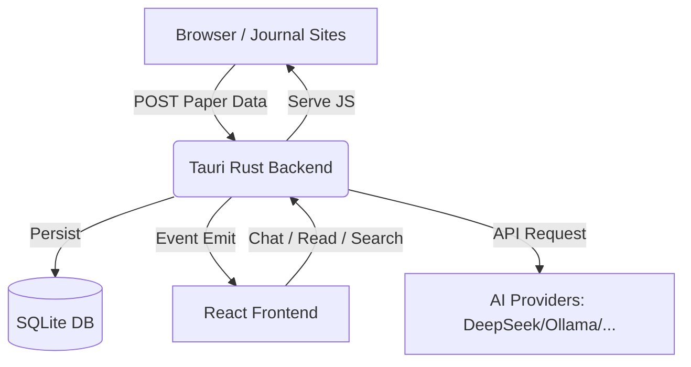

# PaperView

<p align="center">
  
</p>

<p align="center">
  <strong>AI 驱动的学术论文管理与阅读助手</strong>
</p>

<p align="center">
  
  
  
</p>

PaperView 是一个专为科研人员打造的桌面端工具，旨在打通“文献发现 -> 文献捕捉 -> 深度阅读 -> AI 辅助 -> 知识管理”的全链路流程。它能够从浏览器一键采集论文，利用 AI 进行内容总结与问答，并提供极致流畅的 PDF 阅读体验。

---

## ✨ 核心特性

- 📥 **智能捕捉**：通过定制化的浏览器脚本，实时从 Springer、Nature、ScienceDirect 等主流期刊网站同步论文元数据。
- 🤖 **AI 强力辅助**：
  - **自动摘要与翻译**：一键生成中文标题与摘要，快速筛选关键信息。
  - **对话式问答**：基于论文内容进行深度对话，支持 Markdown 与 LaTeX 公式。
  - **智能引用 (Context Chips)**：支持在对话中引用多篇论文，悬停即可预览全文。
  - **自动标题生成**：AI 自动为对话生成简洁标题，告别“未命名对话”。
- 📖 **极致阅读体验**：
  - **三栏式布局**：侧边栏、阅读器、AI 助手同屏协作。
  - **流畅手势**：支持触摸板缩放、智能渲染挂起与平滑滚动。
  - **双语适配**：深度集成 i18n，支持中英文实时切换。
- 🔄 **自动更新**：基于 Tauri v2 原生插件，应用会自动检查并提示升级，确保持续获得最新功能。
- 🔍 **混合检索架构**：基于 SQLite 的结构化管理，未来将集成 Milli 实现精准的语义+全文混合检索。
- ⚙️ **高度可定制**：
  - **跨平台支持**：原生适配 Windows、macOS (Intel/Apple Silicon) 与主流 Linux 发行版。
  - **供应商支持**：原生支持 OpenAI、DeepSeek、Ollama 等主流大模型。
  - **网络适配**：内置系统/自定义代理支持，复杂网络环境无忧。

---

## 🚀 成果路线图 (Roadmap)

### 已完成 (Achievements)
- [x] **Phase 1: 核心同步系统** - 浏览器脚本捕捉与后端 SQLite 同步。
- [x] **Phase 2: PDF 深度阅读** - 触摸手势、缩放优化与中/右侧栏自适应布局。
- [x] **Phase 3: AI 交互增强** - 会话持久化、多论文上下文、悬停预览预览与自动标题生成。
- [x] **Phase 4: 跨平台与分发** - 支持 Windows (WinGet)、macOS、Linux 构建及自动更新。
- [x] **Phase 5: 向量存储基础** - 集成 `sqlite-vec` 插件支持多平台向量检索。

### 进行中 (Next Steps)
- [ ] **语义搜索 (Phase 6)** - 引入 Milli 实现更加精准的混合检索。
- [ ] **知识库图谱** - 基于论文引用的可视化管理。
- [ ] **管理引文** - 与其他文献管理软件（Zotero?）的互联。

---

## 🛠️ 快速开始

### 1. 安装与运行

#### Windows (推荐)
- **WinGet**: 在终端运行 `winget install StevenShenPRC.PaperView`（发布后生效）。
- **手动安装**: 从 [Releases](https://github.com/StevenShenPRC/PaperView/releases) 下载最新的 `.msi` 或 `.exe` 安装包。

#### macOS
- 从 [Releases](https://github.com/StevenShenPRC/PaperView/releases) 下载 `.dmg` 文件（支持 Intel 与 Apple Silicon）。

#### Linux
- 推荐使用 **AppImage**，下载后赋予执行权限即可运行。
- 也提供 `.deb` 安装包供 Debian/Ubuntu 用户使用。

### 2. 配置浏览器扩展
PaperView 导入文献需要与浏览器脚本协作：
1. 安装浏览器脚本管理器（如 [Tampermonkey](https://www.tampermonkey.net/)）。
2. PaperView 启动后，点击左侧边栏底部的 **"JS"** 按钮一键安装。
3. 在支持的期刊网站（如 Nature, ScienceDirect），点击页面右下角的 **"Sync All"** 即可开始同步。

### 3. AI 提供商设置
前往 **“设置 -> AI 设置”**：
- 输入你的 API Key 和 Base URL (兼容 OpenAI 格式)。
- 勾选激活后，即可在右侧 AI 栏开始对话。

---

## 📐 技术架构



---

## 👩‍💻 开发与贡献

```bash
cd app
npm install
npm run tauri dev
```

---

## 📝 许可证

本项目采用 [GPLv3](LICENSE) 许可协议。

---

# English Version

**AI-Powered Academic Paper Management & Reading Assistant**

PaperView is a desktop tool designed for researchers to streamline the workflow from "Discovery -> Capture -> Reading -> AI-Assisted Analysis".

### ✨ Key Features
- 📥 **Smart Capture**: Sync metadata from major journals (Nature, ScienceDirect, etc.) via browser userscript.
- 🤖 **AI Assistant**: Automatic summaries, translations, and deep conversational Q&A based on paper content.
- 📖 **Premium Reading**: Smooth PDF reader with multi-column layout and touchpad gestures.
- 🔄 **Auto-Updates**: Built-in update mechanism powered by Tauri v2.
- ⚙️ **Cross-Platform**: Native support for Windows, macOS, and Linux.

### 🚀 Quick Start
1. **Install**: Download the latest version from [Releases](https://github.com/StevenShenPRC/PaperView/releases).
2. **Browser Extension**: Install Tampermonkey and get our userscript via the **"JS"** button in the app.
3. **AI Setup**: Configure your API Key in the settings (OpenAI compatible).

### 📝 License
This project is licensed under the [GPLv3](LICENSE) License.
